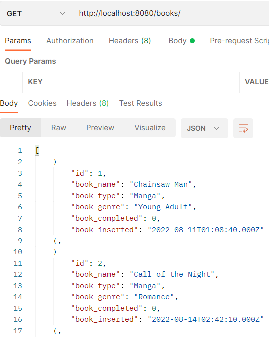
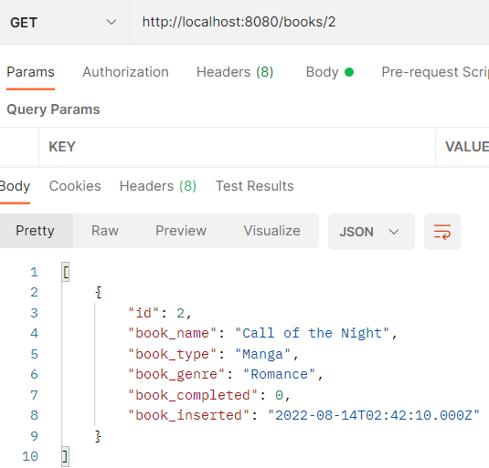
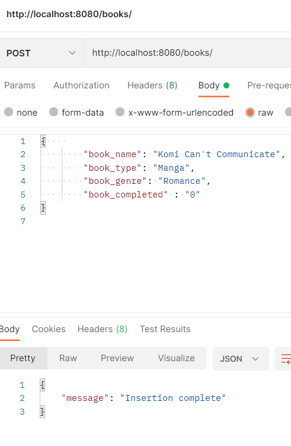
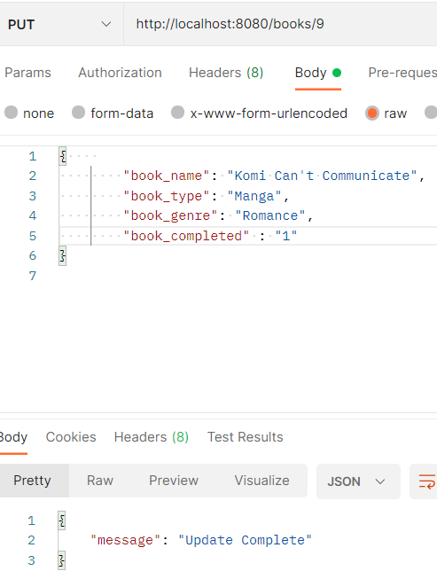
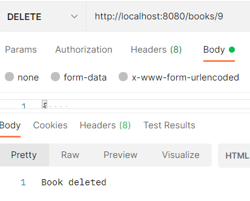

# Book Manager: REST API 
A personal book manager to save and mark completed books. Built using Node and React

Current Repo: REST API built via Node.js

<h1>How to use:</h1> 
  <h2>MySQL</h2> 
    -Create a MySQL database using the credentials from the "config.js" file in the "REST_API" folder 
  <h2>Node</h2> 
    -Download the repo 
    -Run the command: "npm install" to download all dependencies 
    -Move yourself into the "REST_API" directory 
    -Run the command: "node server" to run the REST API 
    -The server will run on local host and will output what port it's running on 
    
    
<h1>REST API Capabilities</h2> 
  <h2>GET</h2> 
  -GET ALL
   
  -GET VIA ID
   
  
  <h2>POST</h2> 
   
  <h2>PUT</h2> 
   
  <h2>DELETE</h2> 
   
